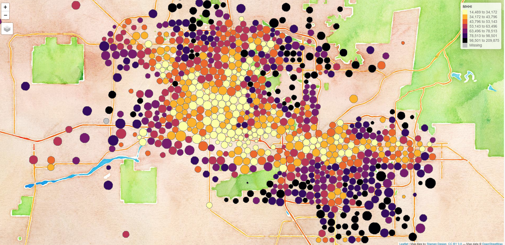

# Data

Some useful files for lectures and labs. 


## Prep LTDB Data for Labs

```r
dat <- read.csv( "ltdb_std_2010_sample.csv", stringsAsFactors=F )

proper.class <- sapply( dat, class )
proper.class[1:4] <- "character"

d2 <- read.csv( "ltdb_std_2010_sample.csv", stringsAsFactors=F,
                 colClasses=proper.class )

for( i in 5:ncol(d2) )
{
  vec <- d2[,i]
  vec[ vec == -999 ] <- NA
  mean.vec <- mean( vec, na.rm=T )
  vec[ is.na(vec) ] <- mean.vec
  d2[,i] <- vec
}

saveRDS( d2, "ltdb_std_2010_sample.rds" )
```

## Load Shapefiles


```r
library( geojsonio )
library( sp )

github.url <- "https://raw.githubusercontent.com/DS4PS/cpp-529-master/master/data/phx_dorling.geojson"
phx <- geojson_read( x=github.url,  what="sp" )

plot( phx )

library( tmap ) 

phx <- spTransform( phx, CRS("+init=epsg:3395") )

bb <- st_bbox( c( xmin = -12519146, xmax = -12421368, 
                  ymax = 3965924, ymin = 3899074 ), 
               crs = st_crs("+init=epsg:3395"))

tm_shape( phx, bbox=bb ) + 
  tm_polygons( col="MHHI", n=10, style="quantile", palette="Spectral" ) +
  tm_layout( "Dorling Cartogram", title.position=c("right","top") )

tmap_mode("view")
tm_basemap( "Stamen.Watercolor" ) +
  tm_shape( phx, bbox=bb ) + 
  tm_polygons( col="MHHI", n=7, style="quantile", palette="-inferno" ) 
```

 


## Create Shapefiles

The code here shows how to create Dorling Cartograms for the Phoenix metro area and convert to GeoJSON files for upload to GitHub:

```r
library( tidycensus )
library( dplyr )

census_api_key("YOUR KEY GOES HERE")

phx.pop <-
get_acs( geography = "tract", variables = "B01003_001",
         state = "AZ", county = "Maricopa", geometry = FALSE ) %>% 
         select( GEOID, estimate ) %>%
         rename( POP=estimate )

phx.mhhi <- 
  get_acs( geography = "tract", variables = "B19013_001",
           state = "AZ", county = "Maricopa", geometry = FALSE ) %>% 
  select( GEOID, estimate ) %>% 
  rename( MHHI=estimate )


library( tigris )

phx <- tracts( state="AZ", county="Maricopa", cb=TRUE, year=2015 )
phx <- merge( phx, phx.pop, by.x="GEOID", by.y="GEOID" )
phx <- merge( phx, phx.mhhi, by.x="GEOID", by.y="GEOID" )


# devtools::install_github( "sjewo/cartogram" )
# install.packages( "tmap" )

library( cartogram )  # spatial maps w/ tract size bias reduction
library( tmap )       # thematic maps
library( maptools )   # spatial object manipulation 
library( sf )         # 'simple features' flavor of shapefiles

# project map and remove empty tracts
phx <- spTransform( phx, CRS("+init=epsg:3395"))
phx <- phx[ phx$POP != 0 & (! is.na( phx$POP )) , ]

# convert census tract polygons to dorling cartogram
# no idea why k=0.03 works, but it does - default is k=5
phx$pop.w <- phx$POP / 10000   # standardizes it to max of 1.5
phx_dorling <- cartogram_dorling( x=phx, weight="pop.w", k=0.03 )

plot( phx_dorling )

tm_shape( phx_dorling ) + 
  tm_polygons( size="POP", col="MHHI", n=7, style="quantile", palette="Spectral" ) 


# WRITE TO FILE 

library( geojsonio )

phx_dorling <- spTransform( phx_dorling, CRS("+proj=longlat +datum=WGS84") )
phx <- spTransform( phx, CRS("+proj=longlat +datum=WGS84") )
geojson_write( phx_dorling, file="phx_dorling.geojson", geometry="polygon" )
geojson_write( phx, file="phx.geojson", geometry="polygon" )
```


```r
tmap_mode("plot")

px1 <- tm_shape( phx_dorling, bbox=bb ) + 
  tm_polygons( size="POP", col="MHHI", n=10, style="quantile", palette="Spectral" ) +
  tm_legend( show=FALSE ) +
  tm_layout( "Dorling Cartogram", title.position=c("right","top") )

px2 <- tm_shape( phx, bbox=bb ) +
  tm_bubbles( size="POP", col="MHHI", n=10, style="quantile", palette="Spectral" ) +
  tm_legend( show=FALSE ) +
  tm_layout( "tmap Bubbles", title.position=c("right","top") )

tmap_arrange( px2, px1 )
```

