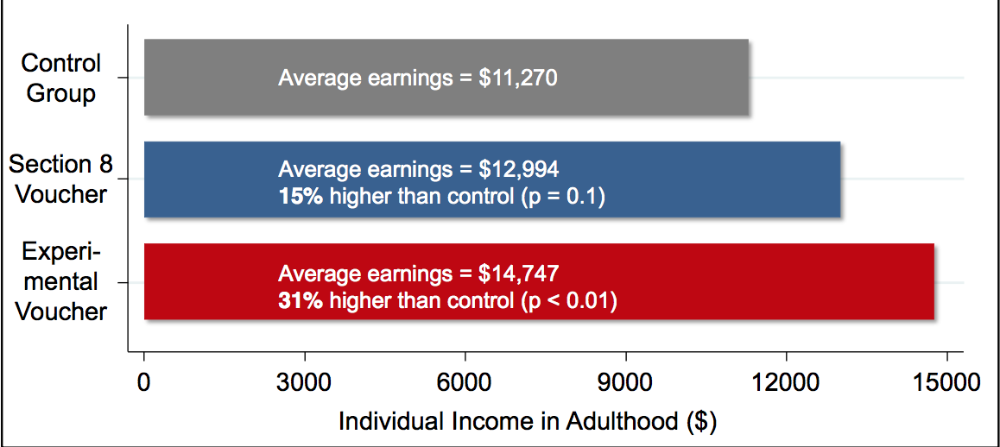

# Do Neighborhoods Matter for Success?

## A Key Question:
 
1. Does geography (e.g. neighborhoods) actually nurture success (or failure)?... Or  

    - Do certain locations just attract those who would succeed (or fail)?

* In Economics jargon: Is there a causal impact of geography on economic success?  

After more than 15 years of mostly mediocre economic growth and rising income inequality, many families say they are frustrated and anxious about trying to get ahead

Hundreds of studies have demonstrated that the odds of economic success vary across neighborhoods. The far more difficult question is whether that’s because neighborhoods nurture success (or failure), or whether they just attract those who would succeed (or fail) anyway.

we documented substantial variation in rates of upward income mobility across commuting zones (aggregations of counties analogous to metropolitan areas) in the United States (Chetty, Hendren, Kline, and Saez 2014). 

This geographic variation could be driven by two very different sources. One possibility is that neighborhoods have causal effects on upward mobility: that is, moving a given child to a different neighborhood would change her life outcomes. Another possibility is that the observed geographic variation is due to systematic differences in the types of people living in each area, such as differences in race or wealth. Distinguishing between these two explanations is essential to determine whether changing neighborhood environments is a good way to improve economic mobility or whether policy makers should focus on other types of interventions.

## Chetty and Henderson (2016): Study Design
* Look at earnings records of five million families that moved with children over 17 year time-period
* Quasi-experimental design that relies on differences in the timing of when families move across areas.
    - Compare adulthood earnings by comparing families that moved from one city to another when their children were young versus older.
* Better than compare families in different areas
    - bias: because some families choose to live in certain areas

Based on the earnings records of five million families that moved with children, track the careers and neighborhoods of five million people over 17 years.

Instead of contrasting the outcomes of families in different areas — which may simply reflect different families choosing to live in different areas — they can track what happens to families when they move. In fact, their analysis is based on more fine-grained comparisons. In particular, they can track families that moved from, say, Cincinnati to Pittsburgh when their children were young and compare them with families that made the same move, but when their children were a few years older.

We use a quasi-experimental approximation to this experiment that relies on differences in the timing of when families move across areas.

it finds that poor children who grow up in some cities and towns have sharply better odds of escaping poverty than similar poor children elsewhere.

The study defined low income as the 25th percentile of the income distribution — a household earning less than three-quarters of other households nationally, or about $30,000 a year for families with children. But the analysis covered the full income distribution, and the geographic patterns at the 25th percentile were very similar to those for poorer and somewhat less poor households.

## Example
* Family A is poor and moves from Cincinnati to Pittsburgh when child is 5-years old
* Family B is poor  makes same move, but child is 14-years old
* Look at adulthood earnings for the 5-year old and 14-year old 

## Main Findings {.smaller}

*  Income at age 26 if from a poor family AND
    - Always lived in Cincinnati:  $23,000
    - Always lived in Pittsburgh:  $28,000
* For a set of families that moved from Cincinnati to Pittsburgh and the child is 
    - 9 years old -->  earn 50% of difference:  $25,500
    - 23 years old --> relatively no gain relative to those who stayed in Cincinnati permanently
    
    

Figure 1 illustrates our approach and results. As an example, consider a set of families who move from Cincinnati to Pittsburgh. Children who grow up in low-income families (at the 25th percentile of the national distribution) in Cincinnati from birth have an income of $23,000 on average at age 26, while those in Pittsburgh have an income of $28,000. Now consider the incomes of children whose families moved from Cincinnati to Pittsburgh at some point in their childhood. Figure 1 plots the fraction of the difference in income between Pittsburgh and Cincinnati that a child will on average obtain by moving at different ages during childhood. Children who were nine years old at the time of the move (the earliest age we can analyze given available data) capture 50% of this difference, leading to an income of approximately $25,500 as adults. Children who move from Cincinnati to Pittsburgh at later ages have steadily declining incomes, relative to those who moved at younger ages. Those whose families moved after they were 23 experience no gain relative to those who stayed in Cincinnati permanently.
Figure 1 shows that every extra year a child spends in a better environment – as measured by the outcomes of children already living in that area – improves her outcomes, a pattern we term a childhood exposure effect. We find equal and opposite exposure effects for children whose families moved to worse areas. Further, we find analogous exposure effects for a broad range of other outcomes, including college attendance and the probability of having a teenage birth.

The key assumption underlying the analysis shown in Figure 1 – the assumption that is necessary to make it as good as the ideal randomized experiment – is that families who move from Cincinnati to Pittsburgh when their children are young are comparable to those who move when their children are older. This assumption would not hold if, for instance, families who move to better areas when their children are young are more educated or have higher wealth than families who move later.

We implement a series of tests to assess the validity of this assumption and evaluate the robustness of our quasi-experimental methodology. First, we compare siblings within the same family, and show that the difference in siblings’ outcomes is proportional to the difference in their exposure to better environments. When a family with two children moves from Cincinnati to Pittsburgh, the younger child does better than the older child on average. Second, we show that one obtains similar estimates of exposure effects when analyzing families displaced by events outside their control, such as natural disasters or local plant closures.
Finally, we exploit differences in cities’ effects across subgroups to develop sharper tests for exposure effects. For example, some areas – such as those with high crime rates – generate significantly worse outcomes for boys than girls. We find that when a family with a boy and a girl moves to such an area, their son’s outcomes worsen in proportion to the number of years he grows up there, but their daughter’s outcomes change much less. Similarly, some areas are particularly good at producing “superstars” – children who reach the top 10% of the income distribution – even though they don’t produce better outcomes on average. We find that children who move to such areas when young are themselves more likely to become superstars, but do not have higher incomes on average.

The main innovation of the new paper  is its focus on children who moved. Doing so allows the economists to ask whether the places themselves actually affect outcomes. The alternative is that, say, Baltimore happens to be home to a large number of children who would struggle no matter where they grew up.

The data suggests otherwise. The easiest way to understand the pattern may be the different effects on siblings, who have so much in common. Younger siblings who moved from a bad area to a better one earned more as adults than their older siblings who were part of the same move. The particular environment of a city really does seem to affect its residents.

Mr. Chetty and Mr. Hendren also subject their analyses to more demanding tests. For instance, rather than making comparisons between families that move at different times, they can also make comparisons within the same family, comparing the results for older and younger siblings after a move. And indeed, when a family moves to a better city, the younger sibling — who will experience more years of exposure to a good neighborhood than an older brother or sister — enjoys better long-run outcomes. Again, the younger sibling enjoys a better future in proportion to the extra years of exposure he or she has.

They also explore what happens in those cities where boys tend to do particularly poorly — typically those with more crime, inequality and segregation. When families with a son and a daughter move to these cities, the son’s outcomes worsen relative to his sister. This gap is larger the longer they both spend in that neighborhood.

## County-Level Estimates of Causal Exposure Effects
* Can estimate the effect of spending an additional year of childhood in each county.

The first part of our study establishes that neighborhoods matter for intergenerational mobility, but does not directly identify the causal effect of any given area. In the second part of our analysis, we estimate the causal childhood exposure effect of every county in the U.S. by studying the outcomes of children who moved between counties at different ages.

To understand how we estimate these effects, consider families in the New York metro area. If we were to find that children who moved from Manhattan to Queens at a young age do better as adults, we can infer that Queens has positive causal exposure effects relative to Manhattan. Building on this logic, we use data on movers across the full set of counties in the U.S. to estimate the effect of spending an additional year of childhood in each county. We construct these estimates separately by parent income level, permitting the effects of each area to vary with the family’s income.

##  Best 10 and Worst 10 places to Live  {.smaller}

* DuPage: 
    - 1 extra year of childhood raises household income in adulthood by 0.76% 
    - Birth-20yrs: Raise a child’s earnings by 15% relative to the national average. 
* Baltimore 
    - 1 extra year of childhood reduces household income in adulthood by 0.86% 
    - Birth-20yrs: Reduce a child’s earnings by 17% relative to the average. 

    

Table 1 shows the causal effects of the top 10 and bottom 10 counties among the 100 largest counties in the U.S for children growing up in families at the 25th percentile of the national income distribution. The estimates represent the percentage change in earnings from spending an additional year of one’s childhood in the relevant county relative to the national average.

For example, each additional year that a child spends growing up in DuPage County, IL raises her household income in adulthood by 0.76%. This implies that growing up in DuPage County from birth – i.e., having about 20 years of exposure to that environment – would raise a child’s earnings by 15% relative to the national average. In contrast, every extra year spent in the city of Baltimore reduces a child’s earnings by 0.86% per year of exposure, generating a total earnings penalty of approximately 17% for children who grow up there from birth.1

## 2015 Baltimore Riots
* Does low chance for economic success help add perspective on understanding social protests against policy brutality?

The places where poor children face the worst odds include some — but not all — of the nation’s largest urban areas, like Atlanta; Chicago; Los Angeles; Milwaukee; Orlando, West Palm Beach and Tampa in Florida; Austin, Tex.; the Bronx; and the parts of Manhattan with low-income neighborhoods.

All else equal, low-income boys who grow up in such areas earn about 35 percent less on average than otherwise similar low-income children who grow up in the best areas for mobility. For girls, the gap is closer to 25 percent.

## Map Results 

## Characteristics of Best Places to Live
* Elementary schools with higher test scores
* A higher share of two-parent families
* Greater levels of involvement in civic and religious groups 
* More residential integration of affluent, middle-class and poor families

The places most conducive to upward mobility include large cities — San Francisco, San Diego, Salt Lake City, Las Vegas and Providence, R.I

They have elementary schools with higher test scores, a higher share of two-parent families, greater levels of involvement in civic and religious groups and more residential integration of affluent, middle-class and poor families.

Across the country, the researchers found five factors associated with strong upward mobility: less segregation by income and race, lower levels of income inequality, better schools, lower rates of violent crime, and a larger share of two-parent households. 

We also find that areas with a larger African-American population tend to have lower rates of upward mobility. These spatial differences amplify racial inequality across generations: we estimate that one-fourth of the gap in intergenerational mobility between blacks and whites can be attributed to the counties in which they live.

Although most places with better odds of escaping poverty have higher rent, the researchers did identify some counties as “upward-mobility bargains.” These include Putnam County, N.Y.; parts of the Pittsburgh and Altoona areas in Pennsylvania; and, if only relative to surrounding areas, Contra Costa.

## Summary

“The data shows we can do something about upward mobility...Every extra year of childhood spent in a better neighborhood seems to matter.” ~ Chetty, Harvard Economist

* The findings suggest that geography does not merely separate rich from poor but also plays a large role in determining which poor children achieve the so-called American dream.

Their findings are clear: The earlier a family moved to a good neighborhood, the better the children’s long-run outcomes. The effects are symmetric, too, with each extra year in a worse neighborhood leading to worse long-run outcomes. Most important, they find that each extra year of childhood exposure yields roughly the same change in longer-run outcomes, but that beyond age 23, further exposure has no effect. That is, what matters is not just the quality of your neighborhood, but also the number of childhood years that you are exposed to it.

“The data shows we can do something about upward mobility,” said Mr. Chetty, a Harvard professor, who conducted the main study along with Nathaniel Hendren, also a Harvard economist. “Every extra year of childhood spent in a better neighborhood seems to matter.”

offers perhaps the most detailed portrait yet of upward mobility — and the lack of it. The findings suggest that geography does not merely separate rich from poor but also plays a large role in determining which poor children achieve the so-called American dream.

## Policy Implications 
1. To improve economic mobility, policy makers should focus on 
    - improving childhood environments (e.g., by improving local schools) 
    - not just on the strength of the local labor market or availability of jobs. 

First, it shows that the neighborhood environment during childhood is a key determinant of a child’s long-term success. This suggests that policy makers seeking to improve mobility should focus on improving childhood environments (e.g., by improving local schools) and not just on the strength of the local labor market or availability of jobs. Second, Figure 1 shows that the incremental benefits of exposure to a better area do not vary with a child’s age. Moving to a better area at age 9 instead of 10 produces the same incremental improvement in earnings as moving to that area at age 15 instead of 16. This finding is particularly important in light of recent discussions about early childhood interventions, as it is shows that there are significant returns to improving children’s environments even at older ages.

 

The data does not answer the question of whether the factors that distinguish higher-mobility places, like better schools and less economic segregation, are causing the differences — or are themselves knock-on effects of other, underlying causes. “We still need clarity on that,” Mr. Grusky, the Stanford professor, said.

For all the benefits that moves can bring, they are not a solution to poverty, said people who have seen the new paper as well as the researchers themselves. Finding ways to improve those neighborhoods, for people who cannot or do not want to move, is also important, researchers and policy makers said.

## Question to Consider 
* We know geography matters for success
* Should government implement policies that encourage poorer households to migrate to richer areas?
    - i.e. Indirect place-based policy
    - What are some potential pros/cons?
    
Let's look at an example!    

# Moving to Opportunity: Mobility policy in US 
## MTO 
* Economic Experiment: 1994-1998 in five large U.S. cities. 
* Approximately 4,600 families living in high-poverty areas 
* Random Assignment into 3 groups based on lottery 
    - MTO Voucher Experiment group: Required to move to area with < 10% poverty
    - Section 8 voucher: provided public housing, but no requirement to move
    - Control Group: No Voucher

- It gave vouchers to help poor families move to better neighborhoods and awarded them on a random basis, so researchers could study the effects.
In the Moving to Opportunity experiment in the mid-to-late 1990s, 4,600 families living in public housing entered a lottery in which the winners were offered a voucher that enabled them to move to better neighborhoods.

The MTO experiment was conducted between 1994 and 1998 in five large U.S. cities. Approximately 4,600 families living in high-poverty public housing projects were randomly assigned to one of three groups: an experimental voucher group that was offered a subsidized housing voucher that came with a requirement to move to a census tract with a poverty rate below 10%, a Section 8 voucher group that was offered a standard housing voucher with no additional contingencies, and a control group that was not offered a voucher (but retained access to public housing).

Because any differences between lottery winners and losers are random, many social scientists view experiments like this as the gold standard for evidence. Consequently, the results from this experiment have been closely watched. 

##  Backdrop

<iframe width="560" height="315" src="https://www.youtube.com/embed/ETR9qrVS17g" frameborder="0" allowfullscreen></iframe>

## Backdrop Los Angeles

* Los Angeles, 1991 Race Riots

* Brought Awareness to Race, Neighborhoods and Urban Poverty 

* Following Race riots, Congress created an anti-poverty experiment called ***Moving to Opportunity (MTO)***. 

## Initial MTO Program Results
* Disappointing 
    -  MTO Voucher no effect on the employment and earnings of parents, 
    - some positive effects physical and mental health, 
    - few notable effects on children. 
    
* Led to conclusion that neighborhood environments are not an important component of economic success.

## A New Hypothesis and New Findings
*  Initial studies too early, failed to take into account enough time to track effects on  younger children that moved 

* New hypothesis:
    - Years of exposure to a good neighborhood is what matters 
    - Subsequent effects during adulthood to be different for toddlers who moved versus teenage 
    - Toddlers enjoy more time in good neighborhood, benefit more. 

Early findings had been disappointing, with no effect on the employment and earnings of parents, some positive effects seen on their physical and mental health, and few notable effects on their children. But the new studies provide a far more optimistic lens for interpreting this evidence.

Previous research on the MTO experiment has found that moving to lower-poverty areas greatly improved the mental and physical health of adults (e.g., Ludwig et al 2013). However, prior work found no impacts of the MTO treatments on the earnings of adults and older youth, leading some to conclude that neighborhood environments are not an important component of economic success.

The original research had not been able to follow the economic outcomes of younger children, because not enough time had passed, Mr. Katz said.
    - Yet if what matters are years of exposure to a good neighborhood — a hypothesis strongly suggested by the second of these two studies — then the effects might be very different, as those who moved as toddlers enjoyed most of their childhood in better neighborhoods, while those who moved as teens received few such benefits yet still had to deal with the disruption of moving.

Prior work has not been able to examine these issues because the younger children in the MTO experiment are only now old enough to be entering the adult labor market.

Led to NEW HYPOTHESIS:  What matters are years of exposure to a good neighborhood

## Chetty et al. (2016):  Results

* The MTO experiment increased the earnings of children who moved to low-poverty areas before age 13 by 31%

Cost-Effective Policy:

The sharpest test comes from those who won an experimental housing voucher that could be used only if they moved to low-poverty areas. Here the findings are striking, as those who moved as a result of winning this voucher before their teens went on to earn 31 percent more than those who did not win the lottery. Other families were awarded Section 8 housing vouchers, which subsidize renting a house or apartment. But because they did not require the winners to move to better parts of the city, people typically moved to neighborhoods that were better but perhaps by only half as much. As a result, the eventual income gains to the preteen children who won this the lottery were about half as large.

The experimental voucher increased the earnings of children who moved at young ages in all five experimental sites, for Whites, Blacks, and Hispanics, and for boys and girls. 

Perhaps most notably, we find robust evidence that the experimental voucher improved long-term outcomes for young boys, a subgroup where prior studies have found little evidence of gains.

The girls raised in better neighborhoods are also more likely to grow up to marry, and when they have children, are more likely to maintain a relationship with the father. They are also more likely to live in better neighborhoods as adults. This suggests that the next generation — the grandchildren of the winners of this lottery — are more likely to be raised by two parents, to enjoy higher family incomes and to spend their entire childhood in better neighborhoods. That is, the gains from this policy experiment are likely to persist over several generations.

## The Moving Age Matters!

* 13+ who moved experienced lower adulthood income
* WHY is this?  

the younger children were when they moved, the better they did. Children were less likely to become single parents when they grew up, were more likely to go to college and to earn more. 

In particular, the previous results actually hide two quite distinct findings, one positive and one negative. The children who moved when they were young enjoyed much greater economic success than similarly aged children who had not won the lottery. And the children who moved when they were older experienced no gains or perhaps worse outcomes, probably the result of a disruptive move, paired with few benefits from spending only a short time in a better neighborhood.

## The Moving Age Matters!

* 13+ who moved experienced lower adulthood income
* WHY is this?  
    1.  Disruptive move?
    2. Few benefits from spending only a short time in a better neighborhood?
    

the younger children were when they moved, the better they did. Children were less likely to become single parents when they grew up, were more likely to go to college and to earn more. 

In particular, the previous results actually hide two quite distinct findings, one positive and one negative. The children who moved when they were young enjoyed much greater economic success than similarly aged children who had not won the lottery. And the children who moved when they were older experienced no gains or perhaps worse outcomes, probably the result of a disruptive move, paired with few benefits from spending only a short time in a better neighborhood.

## Long-Run Benefits of MTO Beyond Income

All told, this re-analysis transforms what was previously seen as influential evidence that neighborhoods are unimportant into the more nuanced finding that moving while young can be tremendously beneficial. Indeed, the net present value of the extra earnings that will eventually accrue to a child who moved at age 8 is $99,000, meaning that for a family with two children, the program yields $198,000 in extra earnings.

The extra tax that these two children will eventually pay is probably $22,000, more than enough to offset the extra cost of the voucher program, relative to the alternative of public housing.

## Policy Implications?
1. New approach to housing policy
    - Reduce waiting times for parents of young children on waiting lists for housing vouchers
    - Current housing policy gives tax incentives to developers who build in poor neighborhoods
    - Instead, should reward developers  who build affordable housing in areas that seem to offer better environments

Some economists who have seen the new study say that it argues for a new approach to housing policy. Current policy often forces the parents of young children onto waiting lists for housing vouchers. It also gives tax incentives to developers who build in poor neighborhoods, rather than rewarding those who build affordable housing in areas that seem to offer better environments.

    
