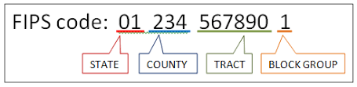
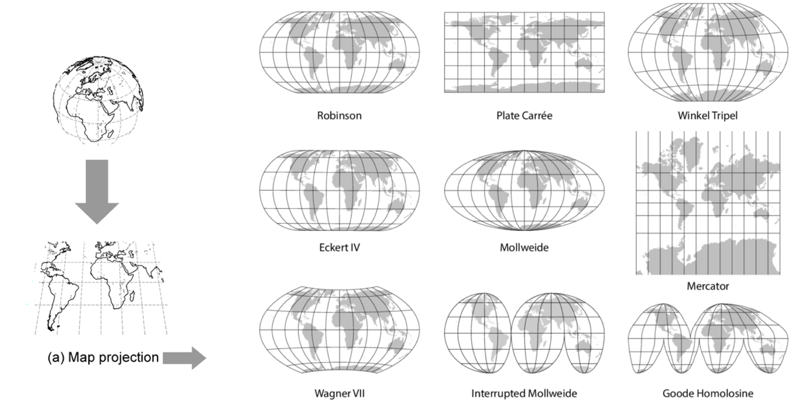

## Agenda

* Working with US Census Data
* Introduction to Mapping
* Creating Maps in R (Part 1)
    - w/ ```tigris``` \&  ```getcensus```
* Creating Maps in R (Part 2)
    - w/ ```tidycensus```

## Working with US Census Data

* Data scientists using R often run into two problems:

    - Understanding what data the Census Bureau publishes.

    - Understanding what R packages on CRAN are available to help with their project.


## Intro to Census Data

* The U.S. Census Bureau is the premier source of data about US people, places and economy. 

* This makes the Bureau a natural source of information for data analysts. 

* The Census Bureau publishes two types of data: 
    - demographic and geographic


## Demographic Data

* The Census Bureau conducts over 100 Censuses, Surveys and Programs. 

* You can view the full list of programs [here](https://www.census.gov/programs-surveys/surveys-programs.html).

* Top 5 most popular(by API requests): 
     
     (1) American Community Survey 
     (2) Decennial Census of Population and Housing
     (3) Population Estimates Program
     (4) Survey of Business Owners
     (5) International Data Base

## American Community Survey (ACS). 

* Info on ancestry, education, income, language, migration, disability, employment, housing 
* Used to allocate government funding, track shifting demographics, plan for emergencies, and learn about local communities. 
* Sent to approximately 295,000 addresses monthly (or 3.5 million per year)
* largest household survey that the Census Bureau administers


## 1, 3, 5 year ACS estimates

<iframe src="https://www.census.gov/programs-surveys/acs/guidance/estimates.html" style="width:700px; height: 500px"
scrolling="yes" marginwidth="0" marginheight="0" frameborder="0" vspace="0" hspace="0">
</iframe>


## Geographic Data 

 The Census Bureau’s geographic hierarchy!


```{r, warning=FALSE,message=FALSE,echo=FALSE, out.width = '50%',fig.align='center'}
knitr::include_graphics("figures/Image7.png")
```

```{r, warning=FALSE,message=FALSE,echo=FALSE, out.width = '30%',fig.align='center'}

```

<style>
  .col2 {
    columns: 2 200px;         /* number of columns and width in pixels*/
    -webkit-columns: 2 200px; /* chrome, safari */
    -moz-columns: 2 200px;    /* firefox */
  }
</style>

## What is a Census Tract?
<div class="col2">

```{r, warning=FALSE,message=FALSE,echo=FALSE, out.width = '40%',fig.align='center'}
knitr::include_graphics("figures/Image8.png")

```


```{r, warning=FALSE,message=FALSE,echo=FALSE, out.width = '100%',fig.align='center'}
knitr::include_graphics("figures/Image9.png")

```

* Designed to be relatively homogeneous, e.g. population characteristics, economic status, living conditions

* Average about 4,000 inhabitants

</div>

## Phoenix Census Tracts

```{r, warning=FALSE,message=FALSE,echo=FALSE, out.width = '100%',fig.align='center'}
knitr::include_graphics("figures/Image11.jpg")

```


## Introduction to Mapping
* Every house, every tree, every city has its own unique latitude and longitude coordinates.

* There are two underlying important pieces of information for spatial data:

    * Coordinates of the object (Lat/Long)
    * How the Lat/Long relate to a physical location on Earth
        * Also known as coordinate reference system or **CRS**

## CRS
```{r, warning=FALSE,message=FALSE,echo=FALSE, out.width = '30%',fig.align='center'}
knitr::include_graphics("figures/projection_tween.gif")

```


* Geographic 
    * Uses three-dimensional model of the earth to define specific locations on the surface of the grid
    * longitude (East/West) and latitude (North/South)
* Projected
    * A translation of the three-dimensional grid onto a two-dimensional plane
    
## CRS



## Types of Spatial Data


* Raster
    * Are values within a grid system
    * Example: Satellite imagery

* Vector
    * Based on points that can be connected to form lines and polygons
    * Located with in a coordinate reference system
    * Example: Road map


## Raster

* Discrete (Land Cover/use maps)
    - Discrete values represent classes, i.e. 1=water; 2=forest
```{r, warning=FALSE,message=FALSE,echo=FALSE, out.width = '50%',fig.align='center'}


```

* Continuous (Satellite Imagery)
    -  Grid cells with gradual changing 

```{r, warning=FALSE,message=FALSE,echo=FALSE, out.width = '50%',fig.align='center'}
knitr::include_graphics("figures/Image16.png")

```


## Vector

```{r, warning=FALSE,message=FALSE,echo=FALSE, out.width = '100%',fig.align='center'}
knitr::include_graphics("figures/Image14.png")

```


## Vector (Cont.)
```{r, warning=FALSE,message=FALSE,echo=FALSE, out.width = '100%',fig.align='center'}
knitr::include_graphics("figures/Image13.png")

```

## Shape files for Vector

Though we refer to a shape file in the singular, it's actually a collection of at least three basic files: 

* .shp - lists shape and vertices
* .shx - has index with offsets
* .dbf - relationship file between geometry and attributes (data)

All files must be present in the directory and named the same (except for the file extension) to import correctly.

<aside class="notes">
R can handle importing different kinds of file formats for spatial data, including KML and geojson. We'll focus on shape files, which was created by ESRI in the '90s.</aside>

## Mapping

* Use vector data and shapefiles to create choropleth maps

* Household Income by Census Tract
```{r, warning=FALSE,message=FALSE,echo=FALSE, out.width = '100%',fig.align='center'}
knitr::include_graphics("figures/Image15.png")

```


## Creating Maps in R

* Download map shapefiles and census data 
    - via online downloads (Old School -- and it sucks!)
    - via API w/ ```tigris``` for maps \&  ```getcensus``` for census data
    - via API w/```tidycensus``` for maps and census data (WINNER!)


## Old School Mapping Approach 


## Old School Mapping Approach 

1. **Download data and transform data**
    * Excel
2. **Find and download shapefiles**
    * Census TIGER
3. **Import maps and join with data and style**
    * ArcGIS or QGIS
4. **Export and tweak for style further**
    * Tableau, CartoDB, Illustrator

## Download Data


## Find and Download Shapefiles

Download a shape file of state boundaries from the [Census](https://www.census.gov/geo/maps-data/data/tiger-cart-boundary.html). 


## Find downloaded data on computer

Point R (or other spatial software) to correct filepath  find File Paths, folders, etc.


* Time consuming and difficult (esp. for beginners) to even read-in the shapefile and census data to spatial software


## New Approach! Downloading shape files directly into R

Using the [**tigris**](https://github.com/walkerke/tigris) package, which lets us download [Census shapefiles](https://www.census.gov/geo/maps-data/data/tiger-line.html) directly into R without having to unzip and point to directories, etc. 

Simply call any of these functions (with the proper location variables):

* `tracts()`
* `counties()`
* `school_districts()`
* `roads()`


<aside class="notes">
Here's a pretty [thorough introduction](https://walkerke.github.io/tigris-webinar/) from the package creator, Kyle Walker.

Shape files can be downloaded simply by referring to them as a function such as
</aside>

## Downloading Census data into R via API

Instead of downloading data from the horrible-to-navigate Census [FactFinder](https://factfinder.census.gov/faces/nav/jsf/pages/index.xhtml) or pleasant-to-navigate [CensusReporter.org](https://censusreporter.org/) we can pull the code with the [**censusapi** package](https://hrecht.github.io/censusapi/articles/getting-started.html) from Hannah Recht, of Bloomberg.


```{r loading_my_key, echo=F}
census_key <- "8eab9b16f44cb26460ecbde164482194b7052772"
Sys.setenv(CENSUS_KEY=census_key)
#readRenviron("~/.Renviron")
```

## Load the censusapi library

First, sign up for a [census key](https://api.census.gov/data/key_signup.html).

Second, replace ```YOURKEYHERE``` with your Census API key.

```
# Add key to .Renviron
Sys.setenv(CENSUS_KEY="YOURKEYHERE") 
# Check to see that the expected key is output in your R console
Sys.getenv("CENSUS_KEY")
```

```{r load_censusapi, warning=F, message=F, echo=T}
library(censusapi)
```


## Look up Census tables

Check out the dozens of data sets you can access.

```
apis <- listCensusApis()
View(apis)
```


## Downloading Census data


We'll focus on using the `getCensus()` function from the package. It makes an API call and returns a data frame of results.

These are the arguments you'll need to pass it:

* `name` - the name of the Census data set, like "acs5" or "timeseries/bds/firms"
* `vintage` - the year of the data set
* `vars` - one or more variables to access
* `region` - the geography level of data, like county or tracts or state


<aside class="notes">
We won't get too deep into the usage of **censusapi**, though I recommend the [excellent documentation](https://hrecht.github.io/censusapi/articles/getting-started.html) later.

Also, using listCensusMetadata will take a very long time to load, so you can skip this step for now.
</aside>

## Get Census metadata


You can use `listCensusMetadata()` to see what tables might be available from the ACS Census survey.

```
acs_vars <- listCensusMetadata(name="acs/acs5", type="variables", vintage=2016)
View(acs_vars)
```
**Slow Process! Please don't run this right now.**

##  Search for data variable names

In the search finder window, type variable of interest, i.e. `median household income`


<aside class="notes">
It takes quite a few minutes to download the list of this data set (23,000 rows!) but once you get it, you can explore it to see what sort of data you might like to download. You can also refer to the Census for [some guidance](https://www.census.gov/programs-surveys/acs/guidance/which-data-tool/table-ids-explained.html).

We'll pull median income: *B21004_001E*
</aside>


## Census variables names
   
* **B21004_001E**, **B19013_001M**, etc.
    * This is reference to a Census table of information.
    * For example, [**A14009**](https://www.socialexplorer.com/data/ACS2016_5yr/metadata/?ds=ACS16_5yr&var=A14009) is Average Household Income by Race for that polygon of data in that row
    * When you export data from the Census, the variables get translated to this sort of format
    * You'll have to remember when you download it or [look it up](https://www.census.gov/programs-surveys/acs/guidance/which-data-tool/table-ids-explained.html).


## Downloading median income


```{r median_income, warning=F, message=F, echo=T}
az_income <- getCensus(name = "acs/acs5", vintage = 2016, 
    vars = c("NAME", "B19013_001E", "B19013_001M"), 
    region = "county:*", regionin = "state:04")
head(az_income)
```

<aside class="notes">
Alright, time to join it to our **az** spatial data frame and map it.
</aside>


## Data Exploration

```{r eval=F}

## Data Wrangling
az_income %>%
rename(MHI_est = B19013_001E ,
MHI_moe = B19013_001M)%>%
mutate(se = MHI_moe/1.645,
cv = (se/MHI_est)*100) %>% #CV is the coefficient of variation
  
  ##Plot
ggplot( aes(x = MHI_est,
y = reorder(NAME, MHI_est))) +
geom_point(color = "black", size = 2) +
geom_errorbarh(aes(xmin = MHI_est - MHI_moe,
xmax = MHI_est + MHI_moe )) +
labs(title = "Median Household Income by County:",
subtitle =
paste0("Arizona US Census/ACS5 2016"),
x = "Median Household Income", y="") +
scale_x_continuous(labels = scales::dollar) +
theme_minimal() +
theme(panel.grid.minor.x = element_blank(),
panel.grid.major.x = element_blank())
```


## Data Exploration

```{r, warning=F, message=F, echo=F}
library(tidyverse)

az_income %>%
rename(MHI_est = B19013_001E ,
MHI_moe = B19013_001M)%>%
mutate(se = MHI_moe/1.645,
cv = (se/MHI_est)*100) %>%
ggplot( aes(x = MHI_est,
y = reorder(NAME, MHI_est))) +
geom_point(color = "black", size = 2) +
geom_errorbarh(aes(xmin = MHI_est - MHI_moe,
xmax = MHI_est + MHI_moe )) +
labs(title = "Median Household Income by County:",
subtitle =
paste0("Arizona US Census/ACS5 2016"),
x = "Median Household Income", y="") +
scale_x_continuous(labels = scales::dollar) +
theme_minimal() +
theme(panel.grid.minor.x = element_blank(),
panel.grid.major.x = element_blank())
```


## Downloading Arizona Shapefile

First, let's make sure the shape files download as **sf** files (because it can also handle **sp** versions, as well)

If **cb** is set to TRUE, it downloads a generalized (1:500k) counties file. Default is FALSE (the most detailed TIGER file).

```{r tigris_install, warning=F, message=F, quietly=T, echo=T, results='hide'}
library(tigris)
options(tigris_use_cache = TRUE)
options(tigris_class = "sf")
az <- counties("AZ", cb=T)
```

## What the az object looks like

```
View(az)
```


## What are the variables


* **STATEFP** is the state fips code. 
    * That stands for the Federal Information Processing Standard. It's a standardized way to identify states, counties, census tracts, etc.
* **GEOID** is also part of the fips code. 
    * In this instance it's only two digits wide. 
    * The more specific you get into the Census boundaries, the longer the number gets.
* **geometry** 
    * This is the Coordinate Reference System (CRS) data

## Mapping Arizona

```{r tigris_map, warning=F, message=F, quietly=T, echo=T, results='hide', out.width = '40%'}
ggplot(az) + 
  geom_sf() +
  theme_void() +
  theme(panel.grid.major = element_line(colour = 'transparent')) +
  labs(title="Arizona counties")
```

## Notes on some code

```
  theme_void() +
  theme(panel.grid.major = element_line(colour = 'transparent')) +
```

* **theme_void()** is a special function that gets rid of grids and gray space for maps
* **theme()** is how you can alter specific styles of the visualization
* **theme_void()** is a collection of individual **theme()** modifications

Time to join the map data and median income data


## Join Income Data (**az_income**) and Spatial (**az**) Map Data
```{r, warning=F, message=F, comment=NA}
head(az_income,1) # county variable name
az[[2]] # CountryFP variable name
```


```{r, warning=F, message=F}
az4ever <- left_join(az, az_income, by=c("COUNTYFP"="county"))
```

## Did it work? 

```{r, az_income, warning=F, message=F}
names(az4ever)
head(az4ever, 1)
```


## Arizona median income

```{r, warning=F, message=F, echo=T,out.width = '40%'}
ggplot(az4ever) + 
  geom_sf(aes(fill=B19013_001E), color="white") +
  theme_void() +
  theme(panel.grid.major = element_line(colour = 'transparent')) +
  scale_fill_distiller(palette="Oranges", direction=1, name="Median income") +
  labs(title="2016 Median income in Arizona counties", caption="Source: US Census/ACS5 2016")
```


## Download Census data and shapefiles together

Newest package for Census data: [**tidycensus**]((https://walkerke.github.io/tidycensus/index.html))

With **tidycensus**, you can download the shape files with the data you want already attached. No joins necessary. 

Let's get right into mapping. We'll calculate unemployment percents by Census tract in Maricopa County.  It'll involve wrangling some data. But querying the data with `get_acs()` will be easy and so will getting the shape file by simply passing it `geometry=T`.

<aside class="notes">
The most recent package dealing with Census data is [**tidycensus**](https://walkerke.github.io/tidycensus/index.html) and it brings together what we've done above-- the data and the geography. It's also created by Kyle Walker.

You can use it to pull data only like with **censusapi** or you can use it to pull shape files only, like with **tigris**.

But with tidycensus you bring both at the same time.

I won't get into the particulars of looking up geography types and Census variables.

</aside>


## Load up tidycensus


```{r tidycensus, warning=F, message=F, echo=T}
library(tidycensus)
```

Pass it your Census key.

```{r key, eval=F, echo=T}
census_api_key("YOUR API KEY GOES HERE")
```

```{r loading_my_key2, echo=F, message=F, quietly=T}
census_api_key(census_key)
```

## Search for variables
```{r}
VarSearch <- load_variables( 2017, "acs5", cache=TRUE )

# convert all letters to upper case

VarSearch$label <- toupper(VarSearch$label)


unemployment <-  VarSearch %>%
  
  mutate( contains.unemployment = grepl( "UNEMPLOYED", label ) ) %>% 
  #Create new variable with Mutate that has UNEMPLOYED in title using grepl

  filter( contains.unemployment )

head(unemployment, 1)
```

## Search for Variables with ```View```

```{r, eval=F}
View(VarSearch)
```

```{r, warning=FALSE,message=FALSE,echo=FALSE, out.width = '50%',fig.align='center'}
knitr::include_graphics("figures/Image19.png")
```

* Select ```Filter``` (top left). In ```label``` box, type ``Hispanic`` 
* We want the total non-hispanic population (```B03001_002```)


## Getting unmployment figures

```{r racejobvars, warning=F, message=F, quietly=T, echo=T, results='hide'}
jobs <- c(labor_force = "B23025_005E", 
              unemployed = "B23025_002E")
arizona <- get_acs(geography="tract", year=2017, survey="acs5", 
                  variables= jobs, county = "Maricopa", 
                  state="AZ", geometry=T)
```

```{r jersey, echo=T}
head(arizona)
```

## Transforming the data


```{r warning=F, message=F, quietly=T, echo=T, results='hide'}
library(tidyr)
arizona<-arizona %>% 
  mutate(variable=case_when( 
    variable=="B23025_005" ~ "Unemployed",
    variable=="B23025_002" ~ "Workforce")) %>%
  select(-moe) %>%  
  spread(variable, estimate) %>%  #Spread moves rows into columns
  mutate(percent_unemployed=round(Unemployed/Workforce*100,2)) 
```

```
head(arizona)
```

<aside class="notes">

Time for some math. Can you follow what's happening in the code based on what you've learned in previous chapters?

We can string the **dplyr** wrangling and **ggplot2** code together. Just watch and look out for the transition from `%>%` to `+`.
</aside>

##  Mapping the data

```{r  warning=F, message=F, quietly=T, echo=T, out.width = '50%'}
library(tidyr)
ggplot(arizona, aes(fill=percent_unemployed)) + 
  geom_sf(color="white") +
  theme_void() + theme(panel.grid.major = element_line(colour = 'transparent')) +
  scale_fill_distiller(palette="Reds", direction=1, name="Estimate") +
  labs(title="Percent unemployed in Maricopa County", caption="Source: US Census/ACS5 2016") +
  NULL
  
```

## Faceting maps (Small multiples)


```{r facet, warning=F, message=F, quietly=T, echo=T, results='hide'}
racevars <- c(White = "B02001_002", 
              Black = "B02001_003", 
              Asian = "B02001_005",
              Hispanic = "B03003_003")
maricopa <- get_acs(geography = "tract", variables = racevars, 
                  state = "AZ", county = "Maricopa County", geometry = TRUE,
                  summary_var = "B02001_001", year=2017, survey = "acs5") 
```


<aside class="notes">
Another example: We'll pull the population of non-Hispanic whites, non-Hispanic blacks, non-Hispanic Asians, and Hispanics by Census tract from the latest ACS Census. The function is `get_acs()` and we'll also add the `summary_var` argument to get multi-group denominators.
</aside>

## Faceting maps (Small multiples)

```
head(maricopa)
```

```{r head_maricopa}
head(maricopa)
```

<aside class="notes">
This is a very tidy data frame. 

And looks like we've have some grouping material.
</aside>

## Transform and map the data

Combine data wrangling and mapping into 1

```
library(viridis)
maricopa %>%
  mutate(pct = 100 * (estimate / summary_est)) %>%
  ggplot(aes(fill = pct, color = pct)) +
  facet_wrap(~variable) +
  geom_sf() +
  coord_sf(crs = 26915) + 
  scale_fill_viridis(direction=-1) +
  scale_color_viridis(direction=-1) +
  theme_void() +
  theme(panel.grid.major = element_line(colour = 'transparent')) +
  labs(title="Racial geography of Maricopa County, Arizona", caption="Source: US Census 2010")
```

## Transform and map the data

```{r faceting, warning=F, message=F, quietly=T, echo=F, results='hide'}
library(viridis)
maricopa %>%
  mutate(pct = 100 * (estimate / summary_est)) %>%
  ggplot(aes(fill = pct, color = pct)) +
  facet_wrap(~variable) +
  geom_sf() +
  coord_sf(crs = 26915) + 
  scale_fill_viridis(direction=-1) +
  scale_color_viridis(direction=-1) +
  theme_void() +
  theme(panel.grid.major = element_line(colour = 'transparent')) +
  labs(title="Racial geography of Maricopa County, Arizona", caption="Source: US Census 2010")
```


## From here, easy to create US maps

Poverty = ```B17001_002```

```{r eval=F}
county_pov <- get_acs(geography = "county",
                      variables = "B17001_002",
                      summary_var = "B17001_001",
                      year = 2017,
                      survey = "acs5",
                      geometry = TRUE,
                      shift_geo = TRUE) %>% 
  mutate(pctpov = 100 * (estimate/summary_est))

## Plot
ggplot(county_pov) +
  geom_sf(aes(fill = pctpov), color=NA) +
  coord_sf(datum=NA) +
  labs(title = "Percent of population in poverty by county",
       subtitle = "Alaska and Hawaii are shifted and not to scale",
       caption = "Source: ACS 5-year, 2016",
       fill = "% in poverty") +
  scale_fill_viridis(direction=-1)
```

## US County Poverty Map 

```{r alaska_hawii, warning=F, message=F, quietly=T, echo=F, results='hide'}
county_pov <- get_acs(geography = "county",
                      variables = "B17001_002",
                      summary_var = "B17001_001",
                      geometry = TRUE,
                      shift_geo = TRUE) %>% 
  mutate(pctpov = 100 * (estimate/summary_est))
ggplot(county_pov) +
  geom_sf(aes(fill = pctpov), color=NA) +
  coord_sf(datum=NA) +
  labs(title = "Percent of population in poverty by county",
       subtitle = "Alaska and Hawaii are shifted and not to scale",
       caption = "Source: ACS 5-year, 2016",
       fill = "% in poverty") +
  scale_fill_viridis(direction=-1)
```

## Lab 2

