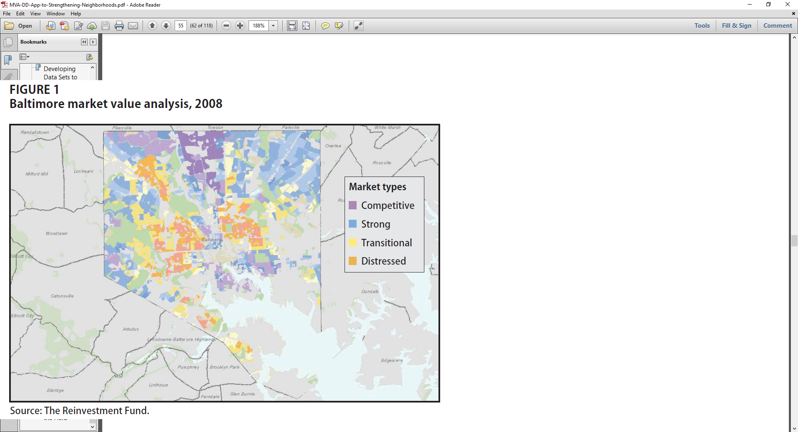

 
<!--- 
New sections start with 2 stars:  ** Section Title
New units start with 3 stars:     *** {Unit Metadata}
-----------------------------start example
** Section-I
*** { @unit = "15th Nov", @title = "Course Overview", @reading, @lecture, @assignment, @foldout }
-----------------------------end example
Unit Metadata is comprised of:
@unit - date or number
@title - unit name
@reading - turn on reading icon
@assignment - turn on lecture icon
@lecture - turn on lecture icon
@foldout - activate unit content (allow foldout)
<a class="uk-button uk-button-default" href="https://ds4ps.org/cpp-529-master/lab-01-instructions/">LAB-01 Instructions</a>
Submit Button - <a class="uk-button uk-button-primary" href="{{page.canvas.assignment_url}}">Submit Lab</a>
-->

<!--- 
######################################################
####
####      COURSE OVERVIEW
####
######################################################
-->

** Course Overview

*** { @unit = "", @title = "Instructor Introduction",  @lecture, @foldout }

 
 

<iframe width="560" height="315" src="https://www.youtube.com/embed/JStm6L476kc?start=1" frameborder="0" allow="accelerometer; autoplay; encrypted-media; gyroscope; picture-in-picture" allowfullscreen></iframe>

 
 

*** { @unit = "", @title = "Course Motivation",  @lecture, @foldout }

 
 

<iframe width="560" height="315" src="https://www.youtube.com/embed/-DZsZqyU4Bk" frameborder="0" allow="accelerometer; autoplay; encrypted-media; gyroscope; picture-in-picture" allowfullscreen></iframe>

 
 

*** { @unit = "", @title = "Syllabus and Course Structure",  @lecture, @foldout }

 
 

<iframe width="560" height="315" src="https://www.youtube.com/embed/l1LMI1mMwe4?start=3" frameborder="0" allow="accelerometer; autoplay; encrypted-media; gyroscope; picture-in-picture" allowfullscreen></iframe>

 
 

*** { @unit = "", @title = "Community Analytics",  @reading, @foldout }

 
 

## Neighborhoods Matter

*Hundreds of studies have demonstrated that the odds of economic success vary across neighborhoods. The far more difficult question is whether that’s because neighborhoods nurture success (or failure), or whether they just attract those who would succeed (or fail) anyway.*

Urban policy scholars have long made the case for the primacy of place:

*Ellen, I. G., & Turner, M. A. (1997). Does neighborhood matter? Assessing recent evidence. Housing Policy Debate, 8(4), 833-866.* [ [pdf](https://github.com/DS4PS/cpp-529-master/raw/master/articles/social-mobility/does-neighborhood-matter-assessing-recent-evidence.pdf) ]

Economists have more recently come to the conclusion that neighborhoods matter more than they expected. For example, see *Justin Wolfers: Why the New Research on Mobility Matters: An Economist's View; The New York Times, May 4, 2015.* [ [link](https://www.nytimes.com/2015/05/05/upshot/why-the-new-research-on-mobility-matters-an-economists-view.html) ] [ [pdf](https://github.com/DS4PS/cpp-529-master/raw/master/articles/social-mobility/why-the-new-research-on-mobility-matters-an-economists-view.pdf) ]

There is growing evidence that neighborhoods can be used as a *treatment* to aid in social mobility, i.e. that programs which help low-income families move to stable and thriving neighborhoods have significant long-term impact on the mobility of the kids. See the Moving to Opportunity Study { [Part 1](https://opportunityinsights.org/paper/newmto/) } and { [Part 2](https://www.citylab.com/equity/2019/08/affordable-housing-assistance-voucher-seattle-neighborhoods/595423/) }.

**The Quality of Neighborhoods Varies Significantly**

*The report shows how America’s yawning inequality extends beyond just money to wide discrepancies in health, knowledge and education, too. As Stanford economist Rebecca Diamond has suggested, inequality of well-being compounds earnings inequality. Her research finds that more well-off and high-skilled Americans accrue additional benefits from living in neighborhoods with better schools, less crime and enhanced public services. Meanwhile, the less skilled and moneyed Americans are shunted off to communities with low quality schools and services. America’s economic divide registers not just in what we can afford to buy, but in the education we have the opportunity to attain and, most basically, in how much time we have to live.*

The Geography of Well-Being, CITYLAB, Richard Florida, APR 23, 2015 [ [link](https://www.citylab.com/life/2015/04/the-geography-of-well-being/391188/) ] 

**A Theory of Neighborhood Change**

Neighborhoods don't start out bad. They typically begin as vibrant middle-class developments that pass through various life-cycles over time. Why do some neighborhoods remain stable and thriving, and others experience drastic decline and stagnation? Theories of neighborhod change have been developed to answer that question. 

*Pitkin, B. (2001). Theories of neighborhood change: Implications for community development policy and practice. UCLA Advanced Policy Institute, 28.* [ [pdf](https://github.com/DS4PS/cpp-529-master/raw/master/articles/neighborhood-change-theories/theories-of-neighborhood-change.pdf) ]

## Data-Driven Approaches to Studying Neighborhoods 

Data can help us better understand the impact that neighborhoods have on residents. This class will help you develop a framework around community analytics - using data science tools to identify and describe neighborhoods in cities, and predict how they might change over time. 

We will specifically draw upon approaches described in:

*Firschein, J. (2015). Putting data to work: data-driven approaches to strengthening neighborhoods. IFC Bulletins chapters, 38.* _**Market Value Analysis: A Data-Based Approach to Understanding Urban Housing Markets, pp 41-60.**_ [ [pdf](https://github.com/DS4PS/cpp-529-master/raw/master/articles/data-driven-models/MVA-DD-App-to-Strengthening-Neighborhoods.pdf) ]

Some data-driven models that help [predict which neighborhoods are most likely to change over time](http://urbanspatialanalysis.com/portfolio/predicting-gentrification-using-longitudinal-census-data/). 

And recent academic work that uses census data and machine learning to identify patterns in community development: 

*Delmelle, E. C. (2017). Differentiating pathways of neighborhood change in 50 US metropolitan areas. Environment and planning A, 49(10), 2402-2424.* [ [pdf](https://github.com/DS4PS/cpp-529-master/raw/master/articles/data-driven-models/differentiating_pathways_to_neighborhood_change.pdf) ]

All three articles share a common approach of using census data and clustering techniques to classify neighborhoods by type, then examine how each type is likely to change over time. 

 

 
 

  
-------------------------------------------------------------------------------------------------------- 
 

<!--- 
######################################################
####
####      WEEK 1
####
######################################################
-->

** Week 1 - Measurement & The Theory of Neighborhoods

*** { @unit = "", @title = "Unit Overview", @reading, @foldout  }

 
 

## Description

This section introduces the field of measurement theory in psychology and social sciences, which is used to create scales or indices that allow us to observe and document things that are not easy to measure. 

> Many variables studied by psychologists are straightforward and simple to measure. These include sex, age, height, weight, and birth order. You can often tell whether someone is male or female just by looking. You can ask people how old they are and be reasonably sure that they know and will tell you. Although people might not know or want to tell you how much they weigh, you can have them step onto a bathroom scale. Other variables studied by psychologists—perhaps the majority—are not so straightforward or simple to measure. We cannot accurately assess people’s level of intelligence by looking at them, and we certainly cannot put their self-esteem on a bathroom scale. **These kinds of variables are called latent CONSTRUCTS** (pronounced CON-structs) and include personality traits (e.g., extraversion), emotional states (e.g., fear), attitudes (e.g., toward taxes), and abilities (e.g., athleticism). [ [Understanding Psychological Measurement](https://opentextbc.ca/researchmethods/chapter/understanding-psychological-measurement/) ]

We are less interested in psychological measures as in constructs of neighborhood quality. But we will use some of the tools developed in psychometrics to help us develop a reliable measure of neighborhood quality. 

## Learning Objectives

Once you have completed this section you will be able to:

* Define a construct 
* Operationalize measurement reliability 
* List theories of neighborhood change 
* Begin to develop reliable measures of neighborhood quality 

## Assigned Reading

REQUIRED:

Schäffer, U. (2007). Management accounting & control scales handbook. Springer Science & Business Media. [ [2-page PDF](https://github.com/DS4PS/cpp-529-master/raw/master/articles/measurement/introduction-to-construct-measurement.pdf) ] 

*Pitkin, B. (2001). Theories of neighborhood change: Implications for community development policy and practice. UCLA Advanced Policy Institute, 28.* [ [pdf](https://github.com/DS4PS/cpp-529-master/raw/master/articles/neighborhood-change-theories/theories-of-neighborhood-change.pdf) ]

FOR REFERENCE:

**Impact of Neighborhoods on Families**

*Ellen, I. G., & Turner, M. A. (1997). Does neighborhood matter? Assessing recent evidence. Housing Policy Debate, 8(4), 833-866.* [ [pdf](https://github.com/DS4PS/cpp-529-master/raw/master/articles/social-mobility/does-neighborhood-matter-assessing-recent-evidence.pdf) ]

**Measurement Theory**

*Measurement Theory and Practice, from: Smith, F. (2002). Research methods in pharmacy practice. Pharmaceutical Press.* [ [pdf](https://github.com/DS4PS/cpp-529-master/raw/master/articles/measurement/measurement-theory-and-practice.pdf) ]

*Schäffer, U. (2007). Management accounting & control scales handbook. Springer Science & Business Media.* [ [full text](https://github.com/DS4PS/cpp-529-master/raw/master/articles/measurement/Management-Accounting-and-Control-Scales-Handbook.pdf) ]

*MacKenzie, S. B., Podsakoff, P. M., & Podsakoff, N. P. (2011). Construct measurement and validation procedures in MIS and behavioral research: Integrating new and existing techniques. MIS quarterly, 35(2), 293-334.* [ [pdf](https://github.com/DS4PS/cpp-529-master/raw/master/articles/measurement/construct-measurement-and-validation-in-behavioral-research.pdf) ]

 
 

*** { @unit = "", @title = "Measurement", @lecture, @foldout  }

 
 

<iframe width="560" height="315" src="https://www.youtube.com/embed/ra5rMqr00Ew?start=192" frameborder="0" allow="accelerometer; autoplay; encrypted-media; gyroscope; picture-in-picture" allowfullscreen></iframe>

[LECTURE Notes - Measurement](https://github.com/DS4PS/cpp-529-master/raw/master/lectures/p-01-measurement.pdf) 

On your lab you will be practicing with index development using census data and the following app:

[https://jdlecy.shinyapps.io/measurement-lab/#section-warmup](https://jdlecy.shinyapps.io/measurement-lab/#section-warmup) 

 
 

*** { @unit = "Due Oct 23nd", @title = "Lab 01", @assignment, @foldout  }

 
 

## Brief Video Instruction

<iframe width="560" height="315" src="https://www.youtube.com/embed/xKV8QPtH52w?start=8" frameborder="0" allow="accelerometer; autoplay; encrypted-media; gyroscope; picture-in-picture" allowfullscreen></iframe>

## Lab-01 - Measurement

<a class="uk-button uk-button-default" href="https://ds4ps.org/cpp-529-master/lab-01-instructions/">LAB-01 Instructions</a>

## Submit Solutions to Canvas:

<a class="uk-button uk-button-primary" href="{{page.canvas.assignment_url}}">Submit Lab</a>

 
 

*** { @unit = "", @title = "Lab 01 Solutions", @assignment  }

Solutions to Lab 1 can be found here [(Lab 1 Solutions)](https://www.dropbox.com/s/ot5h10ucg9hm5m1/lab-02-solutions.docx?dl=1).

 
 

  
--------------------------------------------------------------------------------------------------- 
 

<!--- 
######################################################
####
####      WEEK 2
####
######################################################
-->

** Week 2 - Intro to Census Data and Mapping

*** { @unit = "", @title = "Unit Overview", @reading, @foldout }

 
 

## Description 

This unit will focus on covering two exciting data science topics: (1) Working with Census Data; and (2) Creating choropleth (i.e. color-coded) maps.  The U.S. Census Bureau is the premier source of data about US people, places and economy, making the Bureau a natural source of information for data analysts. 

In general, data scientists using R often run into two problems related to this topic.  First, it can be extremely challenging to understand and find what are the actual data that the Census Bureau publishes.  Second, it can also be challenging to understand what packages in R can be used to efficiently analyze census data.  

This unit will teach students how to resolve both problems, as well as learn mapping tools to effectively transform raw census data into visually appealing choropleth (i.e. color-coded) maps.   This unit includes 4 videos: (1) introduction to Census and Census data; (2) Introduction to Mapping; (3) Mapping Census Data in R; and (4) Mapping Census Data in R with TidyCensus. 

The lecture notes accompanying the videos can be found at the following links: [HTML](https://ds4ps.org/cpp-529-master/lectures/MappingIntro.html#/)
  

## Assigned Reading

REQUIRED:

Florida, R. (2018). Where the House-Price-to-Income Ratio Is Most Out of Whack. [Citylab report](https://www.citylab.com/equity/2018/05/where-the-house-price-to-income-ratio-is-most-out-of-whack/561404/)

 
 

*** { @unit = "", @title = "Introduction to Census Data", @lecture, @foldout  }

<iframe width="560" height="315" src="https://www.youtube.com/embed/9722ZtZ1v1g" frameborder="0" allow="accelerometer; autoplay; encrypted-media; gyroscope; picture-in-picture" allowfullscreen></iframe>

*** { @unit = "", @title = "Introduction to Mapping", @lecture, @foldout }

<iframe width="560" height="315" src="https://www.youtube.com/embed/peSI3dQ1Bbg" frameborder="0" allow="accelerometer; autoplay; encrypted-media; gyroscope; picture-in-picture" allowfullscreen></iframe>

*** { @unit = "", @title = "Mapping Census Data in R", @lecture, @foldout  }

<iframe width="560" height="315" src="https://www.youtube.com/embed/Jys5nZFRf28" frameborder="0" allow="accelerometer; autoplay; encrypted-media; gyroscope; picture-in-picture" allowfullscreen></iframe>

*** { @unit = "", @title = "Mapping Census Data in R w/ TidyCensus", @lecture, @foldout  }

<iframe width="560" height="315" src="https://www.youtube.com/embed/qScoFj5ifTY" frameborder="0" allow="accelerometer; autoplay; encrypted-media; gyroscope; picture-in-picture" allowfullscreen></iframe>

*** { @unit = "Due Oct 30th", @title = "Discussion Assignment: How local governments ensure an accurate census", @assignment, @foldout  }

 
 
Every 10 years, the U.S. Census Bureau conducts a census to determine the number of people living in the United States. 
The data collected by the decennial census are used to determine the number of seats each state has in the U.S. House of Representatives as well as used to inform federal spending and other important federal and state functions.  The task of the census is simple to state yet difficult to execute: count everyone once (no undercount), only once (no overcount), and in the right place (no location errors).

  

**ASSIGNMENT:** 

> For your discussion topic this week, please read and provide general reflection based on the following  two articles [article 1](https://gcn.com/articles/2018/02/12/local-gov-correct-census-addresses.aspx) and [article 2](https://www.amacad.org/news/2020-census-unprecedented-challenges-their-implications).  Discuss also what are some of the challenges faced and new innovations adopted by federal and state governments to ensure an accurate census. 

**Please post your reflection as a new pin on [YellowDig](https://canvas.asu.edu/courses/37703/assignments/842344).**

 

*** { @unit = "Due Oct 30th", @title = "Lab 02", @assignment, @foldout  }

 
 

## Brief Video Instruction

<iframe width="560" height="315" src="https://www.youtube.com/embed/CLMEqpf_3Xo" frameborder="0" allow="accelerometer; autoplay; encrypted-media; gyroscope; picture-in-picture" allowfullscreen></iframe>

## Lab Instructions

Please download the Rmarkdown file (.RMD) below.  In steps 1-4, you can input your R code chunk in the areas that say ``#edit me``.  In Questions 1-3, you can simply answer the questions (i.e. you do not need to show or include any additional code needed to answer the questions).  

Access Lab 2 here: [RMD](https://ds4ps.org/cpp-529-master/labs/Lab2.Rmd) 

Please submit both the .RMD file and .Html file.

## Submit Solutions to Canvas:

<a class="uk-button uk-button-primary" href="{{page.canvas.assignment_url}}">Submit Lab</a>

 
 

*** { @unit = "", @title = "Lab 02 Solutions", @assignment  }

Solutions to Lab 2 can be found here [(HTML)](https://ds4ps.org/cpp-529-master/labs/Lab2Solutions.html) [(RMD)](https://ds4ps.org/cpp-529-master/labs/Lab2Solutions.Rmd). 

 

  
--------------------------------------------------------------------------------------------------- 
 

<!--- 
######################################################
####
####      WEEK 3
####
######################################################
-->

** Week 3 - Identifying Neighborhood Types with Cluster Analysis

*** { @unit = "", @title = "Unit Overview", @foldout  }

## Description 

In this unit, we will be learning how to implement cluster analysis in R as a data reduction technique.  We will classify census tracts in the Pheonix area into group (or neighborhoods) that can be defined on the basis of certain characteristics.  Before we get into the application portion of this unit, it is important to first understand what is cluster analysis and what are some common methods and applications. 

## Assigned Reading 

Required: 

*Temkin, K., & Rohe, W. (1996). Neighborhood change and urban policy. Journal of planning education and research, 15(3), 159-170.* [ [pdf](https://github.com/DS4PS/cpp-529-master/raw/master/articles/neighborhood-change-theories/neighborhood-change-and-urban-policy.pdf) ]

*Grigsby, W., Baratz, M., Galster, G., & Maclennan, D. (1987). The dynamic of neighborhood change and decline. Progress in Planning, 28, 1.* [ [pdf](https://github.com/DS4PS/cpp-529-master/raw/master/articles/neighborhood-change-theories/Grigsby-et-al-1983-Dynamics-of-Neighbourhood-Change-and-Decline.pdf) ]

*Schwirian, K. P. (1983). Models of neighborhood change. Annual review of Sociology, 9(1), 83-102.* [ [pdf](https://github.com/DS4PS/cpp-529-master/raw/master/articles/neighborhood-change-theories/models-of-neighborhood-change.pdf) ]

*** { @unit = "", @title = "Cluster Analysis: Overview", @lecture, @foldout  }

The first video below introduces cluster analysis and a simple partitioning algorithm used to segment data into specific partitions or groups.  The second video below introduces other popular clustering methods -- Hierarchical and model-based clustering.  Model-based clustering is the method we will use in R with the MClust package. The lecture notes can be found [here (PPT)](https://github.com/DS4PS/cpp-529-master/raw/master/lectures/ClusBasic.ppt).

<iframe width="560" height="315" src="https://www.youtube.com/embed/U8zHi32KnJo" frameborder="0" allow="accelerometer; autoplay; encrypted-media; gyroscope; picture-in-picture" allowfullscreen></iframe>

 
 

<iframe width="560" height="315" src="https://www.youtube.com/embed/-_oPRGATOBw" frameborder="0" allow="accelerometer; autoplay; encrypted-media; gyroscope; picture-in-picture" allowfullscreen></iframe>

*** { @unit = "Due Nov 6th", @title = "Lab 03", @assignment, @foldout  }

 
 

## Overview

The purpose of Lab 3 is to show you how to apply model-based clustering to classify Phoenix neighborhoods into meaningful groups.  Lab 3 is a code-through only and will not require you to modify any code as was the case in Lab 2.  

## Lab Instructions

You may access Lab 3 instructions by clicking on the LAB-03 Instructions below.   First view the instructions and see some of the code chunks and output that you will create yourself.  Next, download the Rmardown file ([RMD](https://ds4ps.org/cpp-529-master/labs/lab-03-tutorial.rmd)) and execute each code chunk step-by-step to understand each stage of the process.  

***Reminder:*** Name your files according to the convention: Lab-##-LastName.xxx

<a class="uk-button uk-button-default" href="https://ds4ps.org/cpp-529-master/labs/lab-03-tutorial.html">LAB-03 Instructions</a>

After you have completed Lab 3 you can submit it via Canvas using the link below.  Upload your RMD and your HTML files to the appropriate lab submission link. 

## Submit Solutions to Canvas:

<a class="uk-button uk-button-primary" href="{{page.canvas.assignment_url}}">Submit Lab</a>

 
 

*** { @unit = "Due Nov 6th", @title = "Yellowdig Discussion Assignment: Labeling Phoenix Neighborhood Groups", @assignment, @foldout  }

 
 

Nice job! You have successfully completed lab assignment 3 that relies on a host of census variables and employs model-based clustering (mclust) to group Phoenix neighborhoods into 8 unique categories.  You are now ready for the fun part -- giving a `label` for each neighborhood grouping that adequately represents that particular grouping.  To do this, you need to visually inspect carefully how the census varaibles relate to each neighborhood group and make an informed opinion about what type of label to apply.  

  

**ASSIGNMENT:** 

> For your discussion topic this week, you will  propose labels for Groups 1-8 constructed during Lab 3 using cluster analysis **Image 1** below.  In order to provide an appropriate label, you must do a careful inspection of how the census variables overall relate to a particular group **Image 2**. A good label will be catchy and descriptive of the population within the neighborhood cluster.

**Please post your reflection as a new pin on [YellowDig](https://canvas.asu.edu/courses/37703/assignments/842344).**

 
Image 1:

  
Image 2:

 

--------------------------------------------------------------------------------------------------- 

 

<!--- 
######################################################
####
####      WEEK 4
####
######################################################
-->

** Week 4 - More Practice Clustering 

*** { @unit = "", @title = "Unit Overview", @reading, @foldout  }

## Description 

Neighborhood change is a complicated concept with a lot of loaded terminology. We might think about neighborhoods that are "revitalized", "gentrified", that are "stable", or that "decline".  We could spend an entire semester unpacking all of these constructs, but that is out of scope of the lab. Here we are more interested in how we might make sense of our data, and then once we have meaningful groups how we might use them to make predictions with the data. Can a city forecast how it's current neighborhoods are likely to change over the next decade, and can that help with urban planning processes? 

## Assigned Reading

REQUIRED:

> Market Value Analysis: A Data-Based Approach to Understanding Urban Housing Markets. pp 49-59 [ [PDF](https://github.com/DS4PS/paf-586-summer-2019/raw/master/Reading/MVA-DD-App-to-Strengthening-Neighborhoods.pdf) ]

> Delmelle, E. C. (2017). Differentiating pathways of neighborhood change in 50 US metropolitan areas. Environment and planning A, 49(10), 2402-2424. [ [PDF](https://github.com/DS4PS/paf-586-summer-2019/raw/master/Reading/differentiating-pathways-of-neighborhood-change.pdf) ]

We are interesting in understanding neighborhood change. These data-driven approaches to the phenomenon use machine-learning algorithms to "discover" coherent communities within the city by grouping census tracks into groups that minimize within-group differences and maximize between-group differences. 

You can explore one of these algorithms by looking at examples of how botanists might create "species" based upon characteristics of flowers:

[Clustering Example](https://shiny.rstudio.com/gallery/kmeans-example.html)

A data-driven approach to understanding neighborhood change requires use to (1) define "neighborhoods", or groups of census tracks in the data that are very similar, and (2) use those group characteristics at a point in time to predict how the "neighborhood" might change in the future. Both of the papers present variations on Step (1) above.

 
 

*** { @unit = "Due Nov 6th", @title = "Reading Assignment", @assignment, @foldout  }

 
 

Read the two papers from `Neighborhood Types` section above (Links provided again here: ([ [PDF 1](https://github.com/DS4PS/paf-586-summer-2019/raw/master/Reading/MVA-DD-App-to-Strengthening-Neighborhoods.pdf) ]; [ [PDF 2](https://github.com/DS4PS/paf-586-summer-2019/raw/master/Reading/differentiating-pathways-of-neighborhood-change.pdf) ]), then answer the following questions:

1. **How did each author identify coherent “neighborhoods” (or groups) in each model?**
2. **Would these "neighborhoods" line up with neighborhoods that are defined on a city's zoning maps (Links to an external site.)?**
3. **Did the two models use the same data to create the groups?**
4. **How do the labels and descriptions of the groups differ in each model and why?**

Please copy these questions, along with your answers, at the beginning of your .rmd file used for Lab 4 (See Lab 4 assignment below). 

*** { @unit = "", @title = "Geography and Economic Success", @lecture, @foldout  }

A new study by the Harvard economists Raj Chetty and Nathaniel Hendren, when read in combination with an important study they wrote with Lawrence Katz, makes the most compelling case to date that **good neighborhoods nurture success**... they are the most powerful demonstration yet that neighborhoods — their schools, community, neighbors, local amenities, economic opportunities and social norms — are a critical factor shaping your children’s outcomes. It’s an intuitive idea, although the earlier evidence for it had been surprisingly thin.

I discuss Chetty's work in the video lecture below. 

 
 
(Note: Audio begins at the 10 second mark.)

<iframe width="560" height="315" src="https://www.youtube.com/embed/Q7nzIOHTSto?start=2000" frameborder="0" allow="accelerometer; autoplay; encrypted-media; gyroscope; picture-in-picture" allowfullscreen></iframe>

 
 

*** { @unit = "Due Nov 13th", @title = "Lab 04", @assignment, @foldout  }

 
 

## Overview

The purpose of Lab 4 is to replicate the work you did for the previous lab, but instead of using the Phoenix data you will select a city of your choice to use for this lab, and the final project.

## Lab Instructions

You may access Lab 4 instructions by clicking on the LAB-04 Instructions below.   

***Reminder:*** Include the four questions, along with your answers from the reading assignment (see above) at the beginning of your RMD file. 

## Lab Instructions

<a class="uk-button uk-button-default" href="https://ds4ps.org/cpp-529-master/labs/lab-04-instructions.html">LAB-04 Instructions</a>

## Submit Solutions to Canvas:

<a class="uk-button uk-button-primary" href="{{page.canvas.assignment_url}}">Submit Lab</a>

 

--------------------------------------------------------------------------------------------------- 
 

<!--- 
######################################################
####
####      WEEK 5
####
######################################################
-->

** Week 5 - Visualizing Neighborhood Changes  

*** { @unit = "", @title = "Unit Overview", @foldout  }

## Description 

In this unit, a brief video introduction is given related to neighborhood change and gentficication, serving as important foundation for our data science work using census data to visualize changes in neighborhoods over time.  The second goal of this unit is to offer a set of "good practices" when creating maps to display spatial information.  

*** { @unit = "", @title = "Neighborhood Change and Gentficication", @lecture, @foldout  }

The first video below provides a general overview of neighborhood change and gentrification, including: defintions, debates,  policies, and a case study example.  The lecture notes can be found [here (PDF)](https://github.com/DS4PS/cpp-529-master/raw/master/lectures/Gentrification_and_affordable_housing_2016.pdf).

 

<iframe width="560" height="315" src="https://www.youtube.com/embed/b4GgKBhltu8" frameborder="0" allow="accelerometer; autoplay; encrypted-media; gyroscope; picture-in-picture" allowfullscreen></iframe>

 

*** { @unit = "", @title = "Visualization Recap", @lecture, @foldout  }

The video below describes the importance of creating maps that accurately conveys spatial information contained in the underlying data.  Far too often, maps are used incorrectly to advocate a certain narrative that does not accurately reflect underlying data.  As data scientists, it is important that we are careful of how we map spatial information.  The lecture notes can be found [here (PDF)](https://github.com/DS4PS/cpp-529-master/raw/master/lectures/Lecture-Visual_Narrative- Choropleth_and_Dot_Density_Maps.pdf).

 

<iframe width="560" height="315" src="https://www.youtube.com/embed/AWwOYNvxK-A" frameborder="0" allow="accelerometer; autoplay; encrypted-media; gyroscope; picture-in-picture" allowfullscreen></iframe>

 

*** { @unit = "Due Nov 20th", @title = "Lab 05", @assignment, @foldout  }

 
 

## Lab Instructions

There are 3 parts to this week's lab.  The first two parts are largely a review and a primer of what we've done already and where we are heading.  The Rmarkdown file and HTML file is below.  

Access Parts 1 and 2 of Lab 5 here: [RMD](https://github.com/DS4PS/cpp-529-master/raw/master/LABS/Lab5a-MapVis1.Rmd); [HTML](https://github.com/DS4PS/cpp-529-master/raw/master/LABS/Lab5a-MapVis1.html)

After you go through Parts 1 and 2, please download part 3 of the lab, which focuses on using dot density maps to display changes in demographics, in this case with respect to education levels.  There are several questions for you to consider at the bottom of the file that pertain to all parts of the lab.   The Rmarkdown file and HTML file is below.  

Access Part 3 Lab 2 here: [RMD](https://github.com/DS4PS/cpp-529-master/raw/master/LABS/Lab5b-MapVis2.Rmd); [HTML](https://github.com/DS4PS/cpp-529-master/raw/master/LABS/Lab5b-MapVis2.html) 

Please submit your .rmd and .html files for Part 3 of the lab only, including your answers to the questions.  

## Submit Solutions to Canvas:

<a class="uk-button uk-button-primary" href="{{page.canvas.assignment_url}}">Submit Lab</a>

 
 

*** { @unit = "Due Nov 20th", @title = "Yellowdig Discussion Assignment: Predicting Neighborhood Change", @assignment, @foldout  }

 
 

### Required Readings

1. Using Algorithms To Predict Gentrification [(Link)](https://www.citylab.com/solutions/2017/02/algorithms-that-predict-gentrification/516945/)

2. How Machine Learning and AI Can Predict Gentrification [(Link)](https://www.citylab.com/life/2018/12/gentrification-london-ai-machine-learning/578329/)

### Questions

1. Provide a 2-3 sentence summary of the above two articles (research topic, data, method, findings). 

2. What are the main variables used to predict gentrification in the above studies? 

3.  What other information would you like to have that you think would be an important predictor of gentrification?

  
--------------------------------------------------------------------------------------------------- 
 

<!--- 
######################################################
####
####      WEEK 6
####
######################################################
-->

** Week 6 - OLS Regression and Models of Neighborhood Change 

*** { @unit = "", @title = "Unit Overview", @foldout  }

## Description 

In this unit, a set of brief videos are provided to give an introduction and overview of employing model regressions in R.  In the lab, we will then use regression analysis to explore how changes in certain demographic variables influence change in house prices over time. 

The second theme of this unit is to continue working with cluster analysis to classify neighborhoods (at the tract or county level) into groups and provide appropriate labels for those groups based on how the demographic information relates to them.  We will then extent our cluster analysis to predict clusters using the same set of demographic variables for a different time period, and then track how counties (or tracts) transition from one cluster grouping to another over time. 

*** { @unit = "", @title = "Regression Overview", @lecture, @foldout  }

This set of videos provide a general overview of Ordinary Least Squares (OLS) model regression.  The lecture notes can be found [here (HTML)](https://ds4ps.org/cpp-529-master/lectures/OLS.html).

 

### OLS Introduction

<iframe width="560" height="315" src="https://www.youtube.com/embed/3nQrCvJun-4" frameborder="0" allow="accelerometer; autoplay; encrypted-media; gyroscope; picture-in-picture" allowfullscreen></iframe>

### OLS Graphical Example 

<iframe width="560" height="315" src="https://www.youtube.com/embed/o9VrJtKScE4" frameborder="0" allow="accelerometer; autoplay; encrypted-media; gyroscope; picture-in-picture" allowfullscreen></iframe>

### OLS Assumptions

<iframe width="560" height="315" src="https://www.youtube.com/embed/laq6rDlq6S4" frameborder="0" allow="accelerometer; autoplay; encrypted-media; gyroscope; picture-in-picture" allowfullscreen></iframe>

### Manual OLS with Matrix Algebra

<iframe width="560" height="315" src="https://www.youtube.com/embed/2BN_23cFh2E" frameborder="0" allow="accelerometer; autoplay; encrypted-media; gyroscope; picture-in-picture" allowfullscreen></iframe>

### OLS Example using Crime Data

<iframe width="560" height="315" src="https://www.youtube.com/embed/jPUd5xiVSqo" frameborder="0" allow="accelerometer; autoplay; encrypted-media; gyroscope; picture-in-picture" allowfullscreen></iframe>

 

*** { @unit = "Due Nov 27th", @title = "Lab 06", @assignment, @foldout  }

 
 

## Lab Instructions

This will be the last lab for the semester and will serve as the primary foundation for your final city project.  There are two parts to the lab.  

In the first part, you will download census information from the 2008-2012 ACS 5-year estimates and the 2013-2017 ACS 5-year estimates,  calculate change over time for each variable, and then run OLS regression to explore how changes in demographic variables relate to changes in house prices at the county level.  

In the second part, you will perform cluster analysis, as in previous labs, but this time grouping all US counties into unique groups based on variables from the 2013-2017 ACS 5-year estimates.  As before, you will visualize how demographic information relates to each group and provide an appropriate label.  

What's new in this part 2 of the lab is that you will then combine the cluster model output performed for counties during the 2013-2017 period, and `predict` what cluster groups those counties would have been in during the 2008-2012 time period. Next, you will track transitions of counties from one cluster group to another over the 2008-2012 and 2013-2017 time period, and see how those changes relate to house prices.  From here you will attempt to detect which cluster groups gentrified over the time period.   

Access the lab here: [RMD](https://github.com/DS4PS/cpp-529-master/raw/master/LABS/Lab6-RegClustPred.Rmd); [HTML](https://www.dropbox.com/s/ao6dpep5n559sm5/Lab6-RegClustPred.html?dl=1) 

Please submit your .rmd and .html files on Canvas, including your answers to the questions.  

## Submit Solutions to Canvas:

<a class="uk-button uk-button-primary" href="{{page.canvas.assignment_url}}">Submit Lab</a>

 
 

*** { @unit = "Due Nov 27th", @title = "Yellowdig Discussion Assignment: Predicting Neighborhood Change", @assignment, @foldout  }

 
 

### Required Readings

1. Gentrification Has Virtually No Effect on Homeowners [(Link)](https://www.citylab.com/equity/2017/01/gentrification-hurts-renters-more-than-homeowners/510074/)

### Questions

1.  Summarize the main debate about gentrification and what your stance is after reading the article. 

2. How does the study by Martin and Beck define gentrification?  What are the limits/advantages of using this definition?  

3. How does our approach taken in the lab to identify potential clusters of counties that gentrified compare to Martin and Beck's definition of gentrification?  Is our approach better?  What other variables should we like to include in our cluster anlaysis to better describe gentrified areas?  

 
--------------------------------------------------------------------------------------------------- 
 

<!--- 
######################################################
####
####      WEEK 7
####
######################################################
-->

** Week 7 - Final Project 

*** { @unit = "Due Dec 2nd", @title = "Explainer Assignment", @assignment, @foldout  }

 
 

## Code-Through
 
<a class="uk-button uk-button-default" href="https://ds4ps.org/cpp-529-master/LABS/code-through-assignment.html">Code-Through Instructions</a>

## Submit to Canvas:

<a class="uk-button uk-button-primary" href="">SUBMIT CODE-THROUGH</a>

## Post on Yellowdig

Publish your code-through as an RPub or shiny app. Share you link on YellowDig. 

<a class="uk-button uk-button-primary" href="https://www.yellowdig.com/board/42045">Yellowdig</a>

*** { @unit = "Due Dec 6th", @title = "DASHBOARD", @assignment, @foldout }

 
 

For the final project, you will extend the work you've done over the course of the semester by creating a dynamic dashboard that will be used to detect neighborhood change and gentrification at the census tract level for your metroplitan statistical area (MSA) of choice.  

To this end, you will combine aspects into your final project from Lab 4 that focuses on your selected MSA to perform cluster analysis and create a dorling map of your 2010 cluster and Lab 6 (descriptives, regression, clustering, clustering prediction, and sankey charting). 

The goal of your dynamic dashboard is to empower members of the City Council to better understand economic and demographic trends impacting the communities they govern.  

As part of the final project, you will also record a video presentation of 15-20 minutes and give an oral presentation of your dynamic dashboard.  Be sure to highlight your findings, and policy implications and recommendations.  You may record the video presentation on your computer and then upload it to [youtube](https://www.youtube.com/upload). 

Submission: You will submit the .rmd file, the .html file, and the link to your youtube video to Canvas. 

## Instructions

The skeleton for the final project using `flex_dashboard` can be downloaded here [(LINK to FINAL PROJECT .RMD)](https://www.dropbox.com/s/edmitdjdsdrm54z/Final_Project_Outline_Storyboard.Rmd?dl=1).  The first thing you should do after downloading the file, is to open it and then knit it in order to make sure it compiles properly.  If it does not, check that all R packages are updated.  

You have two major coding tasks denoted as `edit me` in R chunks: (1) subset all census data from Lab 6 to your chosen MSA from Lab 4; and (2) merge spatial information from Lab 4 to census data from Lab 6.  

In addition to the two coding task you must also describe your research project and interpret the results.  Specifically, when viewing the knitted dashboard, you should notice latin placeholder text in some areas.  The latin placeholder text is created using `r lorem::ipsum(paragraphs = 1)` that you can see in the .rmd file, followed by some instructions enclosed within notes (<!---  -->) that are commented out.  

You will need to delete each instance of `r lorem::ipsum(paragraphs = 1)` placeholder text in the .rmd file and provide your own answers based on the instructions contained within notes (<!---  -->).  There are ***11*** instances of latin placeholder text that you need to remove and provide answers.   

Once you have completed the final project, you should record a well-rehearsed presentation of 15-20 minutes targeting local government and community leaders. You may post the video on [youtube](https://www.youtube.com/upload).  When uploading to youtube, you can select the unlisted option to keep the video from being found via search, rather it can only be viewed if you have the link.

Submission: You will submit the .rmd file, the .html file, and the link to your youtube video to Canvas. 

## Submit Solutions to Canvas:

<a class="uk-button uk-button-primary" href="{{page.canvas.assignment_url}}">Submit Lab</a>

 
 

 
 

-----

 
 

