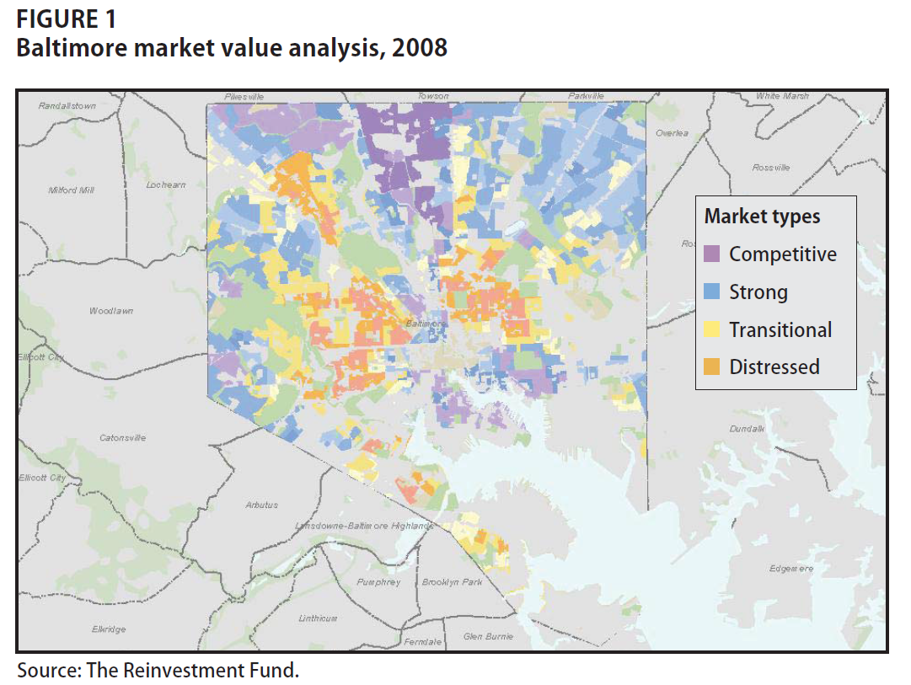

 
<!--- 
New sections start with 2 stars:  ** Section Title
New units start with 3 stars:     *** {Unit Metadata}
-----------------------------start example
** Section-I
*** { @unit = "15th Nov", @title = "Course Overview", @reading, @lecture, @assignment, @foldout }
-----------------------------end example
Unit Metadata is comprised of:
@unit - date or number
@title - unit name
@reading - turn on reading icon
@assignment - turn on lecture icon
@lecture - turn on lecture icon
@foldout - activate unit content (allow foldout)
Submit Button - <a class="uk-button uk-button-primary" href="{{page.canvas.assignment_url}}">Submit Lab</a>
-->


** Welcome


*** { @unit = "", @title = "Course Overview: Community Analytics", @foldout }


## A Theory of Neighborhoods

*Hundreds of studies have demonstrated that the odds of economic success vary across neighborhoods. The far more difficult question is whether that’s because neighborhoods nurture success (or failure), or whether they just attract those who would succeed (or fail) anyway.*

**Neighborhoods Matter** 

Urban policy scholars have long made the case for the primacy of place. 

*Ellen, I. G., & Turner, M. A. (1997). Does neighborhood matter? Assessing recent evidence. Housing Policy Debate, 8(4), 833-866.* [ [pdf]() ]

Economists have come to the conclusion that neighborhoods matter more than they expected. See Justin Wolfers: Why the New Research on Mobility Matters: An Economist's View; The New York Times, May 4, 2015. [ [link](https://www.nytimes.com/2015/05/05/upshot/why-the-new-research-on-mobility-matters-an-economists-view.html) ] [ [pdf]() ]

And there is growing evidence that neighborhoods can be used as a *treatment* of sorts to aid social mobility, i.e. that programs which help low-income families move to stable and thriving neighborhoods have significant long-term impact on the mobility of the kids. See the Moving to Opportunity Study [Part 1](https://opportunityinsights.org/paper/newmto/) and [Part 2](https://www.citylab.com/equity/2019/08/affordable-housing-assistance-voucher-seattle-neighborhoods/595423/).

**The Quality of Neighborhoods Varies Significantly**

*The report shows how America’s yawning inequality extends beyond just money to wide discrepancies in health, knowledge and education, too. As Stanford economist Rebecca Diamond has suggested, inequality of well-being compounds earnings inequality. Her research finds that more well-off and high-skilled Americans accrue additional benefits from living in neighborhoods with better schools, less crime and enhanced public services. Meanwhile, the less skilled and moneyed Americans are shunted off to communities with low quality schools and services. America’s economic divide registers not just in what we can afford to buy, but in the education we have the opportunity to attain and, most basically, in how much time we have to live.*

The Geography of Well-Being, CITYLAB, Richard Florida, APR 23, 2015 [ [link](https://www.citylab.com/life/2015/04/the-geography-of-well-being/391188/) ] 

**A Theory of Neighborhood Change**

Neighborhoods don't start out bad. They typically begin as vibrant middle-class developments that pass through various life-cycles over time. Why do some neighborhoods remain stable and thriving, and others experience drastic decline and stagnation? Theories of neighborhod change have been developed to answer that question. 

*Pitkin, B. (2001). Theories of neighborhood change: Implications for community development policy and practice. UCLA Advanced Policy Institute, 28.* [ [pdf]() ]

For reference: 

*Temkin, K., & Rohe, W. (1996). Neighborhood change and urban policy. Journal of planning education and research, 15(3), 159-170.* [ [pdf]() ]

*Grigsby, W., Baratz, M., Galster, G., & Maclennan, D. (1987). The dynamic of neighborhood change and decline. Progress in Planning, 28, 1.* [ [pdf]() ]

*Schwirian, K. P. (1983). Models of neighborhood change. Annual review of Sociology, 9(1), 83-102.* [ [pdf]() ]

**Data-Driven Models of Neighborhood Change**

The early theoretical work has been augmented by data-driven models that help [predict which neighborhoods are most likely to change over time](http://urbanspatialanalysis.com/portfolio/predicting-gentrification-using-longitudinal-census-data/). 

In this class we will specifically draw upon approaches described in:

*Firschein, J. (2015). Putting data to work: data-driven approaches to strengthening neighborhoods. IFC Bulletins chapters, 38.* _**Market Value Analysis: A Data-Based Approach to Understanding Urban Housing Markets, pp 41-60.**_ [ [pdf]() ]

And recent academic work that uses census data and machine learning to identify patterns in community development: 

*Delmelle, E. C. (2017). Differentiating pathways of neighborhood change in 50 US metropolitan areas. Environment and planning A, 49(10), 2402-2424.* [ [pdf]() ]

Both articles share a model where they use census data and clustering techniques to classify neighborhoods by type, then examine how each type is likely to change over time. 

 


## Community Analytics

<br>
<br>

<a class="uk-button uk-button-primary" href="{{page.canvas.assignment_url}}">Submit Lab</a>

<br>
<br>


## Census Data


In this course we cover the foundations of data programming with the R language. In order to create robust and dynamic analysis we need to use a couple of tools that were built to leverage the power of R and create compelling narratives. R Studio helps you manage projects by organizing files, scripts, packages and output. Markdown is a simple formatting convention that allows you to create publication-quality documents. And R Markdown is a specific version of Markdown that allows you to combine text and code to create data-driven documents. 

[CH-01 Core R](http://ds4ps.org/dp4ss-textbook/ch-010-core-r.html)

[CH-02 R Studio](http://ds4ps.org/dp4ss-textbook/ch-020-rstudio.html)

[Data-Driven Docs](http://ds4ps.org/dp4ss-textbook/ch-030-data-driven-docs.html)

[A Markdown Guide](http://ds4ps.org/dp4ss-textbook/ch-031-markdown.html)

<br>


<br>
<br>


## GIS

[Getting Started with R Markdown](https://rmarkdown.rstudio.com/lesson-1.html)

You will have plenty of practice with these tools this semester. You will submit your labs as knitted R Markdown (RMD) files.

[](../gifs/NewCodeChunk/NewCodeChunk.html)

<br>
<br>


*** { @unit = "", @title = "Assignments",  @foldout }


<br>
<br>

Overview of expectations. 

Description of Project. 

<br>
<br>


*** { @unit = "", @title = "Getting Help",  @foldout   }


<br>
<br>
How to contact Professor Howell
How to get help on labs 

* Instructions for creating new questions
* Posting reproducible examples 

<br>
<br>


** Week 1 - Measurement & The Theory of Neighborhoods

*** { @unit = "", @title = "Unit Overview", @foldout  }


## Description

This section introduces the field of measurement theory in psychology and social sciences, which is used to create scales or indices that allow us to observe and document things that do

*Many variables studied by psychologists are straightforward and simple to measure. These include sex, age, height, weight, and birth order. You can often tell whether someone is male or female just by looking. You can ask people how old they are and be reasonably sure that they know and will tell you. Although people might not know or want to tell you how much they weigh, you can have them step onto a bathroom scale. Other variables studied by psychologists—perhaps the majority—are not so straightforward or simple to measure. We cannot accurately assess people’s level of intelligence by looking at them, and we certainly cannot put their self-esteem on a bathroom scale. These kinds of variables are called **constructs** (pronounced CON-structs) and include personality traits (e.g., extraversion), emotional states (e.g., fear), attitudes (e.g., toward taxes), and abilities (e.g., athleticism).* [ [Understanding Psychological Measurement](https://opentextbc.ca/researchmethods/chapter/understanding-psychological-measurement/) ]

We are less interested in 

*A new study by the Harvard economists Raj Chetty and Nathaniel Hendren, when read in combination with an important study they wrote with Lawrence Katz, makes the most compelling case to date that good neighborhoods nurture success... These two new studies are the most powerful demonstration yet that neighborhoods — their schools, community, neighbors, local amenities, economic opportunities and social norms — are a critical factor shaping your children’s outcomes. It’s an intuitive idea, although the earlier evidence for it had been surprisingly thin. As Sean Reardon, a professor of education and sociology at Stanford, said of the study, “I think it will change some of the discussion around how where children grows up matters.”*

## Learning Objectives

Once you have completed this section you will be able to 
* Define a construct 
* 

## Assigned Reading

Required:

Schäffer, U. (2007). Management accounting & control scales handbook. Springer Science & Business Media. [ [2-page PDF]() ] 


Grigsby, W., Baratz, M., Galster, G., & Maclennan, D. (1987). The dynamic of neighborhood change and decline. Progress in Planning, 28, 1.

Background Chapters:

**You will start simple and get practice with these tools on labs. Skim these, then return for reference as you get stuck or want to deepend your knowledge.**

[Learning to Learn R](http://ds4ps.org/dp4ss-textbook/ch-032-learning_r.html)

[Core R](http://ds4ps.org/dp4ss-textbook/ch-010-core-r.html)

[R Studio](http://ds4ps.org/dp4ss-textbook/ch-020-rstudio.html)

[Data-Driven Docs](http://ds4ps.org/dp4ss-textbook/ch-030-data-driven-docs.html)

[Markdown](http://ds4ps.org/dp4ss-textbook/ch-031-markdown.html)


## Lab 

Lab-01 covers the following topics:

* R Markdown (template provided)
* Vectors
  - numeric 
  - character 
  - factor 
  - logical 

**Functions**

```r
names()                 # variable names
head()                  # preview dataset
$ operator              # reference a vector inside a dataset
length()                # vector dimensions
dim(), nrow(), ncol()   # dataset dimensions
sum(), summary()        # summarize numeric vectors
table()                 # summarize factors / character vectors
```

**Data**:

Syracuse tax parcels: [ [documentation](https://ds4ps.org/Data-Science-Class/DATA/syr_parcels.html) ]

```r
URL <- "https://raw.githubusercontent.com/DS4PS/Data-Science-Class/master/DATA/syr_parcels.csv"
dat <- read.csv( URL, stringsAsFactors=FALSE )
head( dat )
```

**Downtown Syracuse**


**All 42,000 Parcels**


*** { @unit = "Due Aug 26th", @title = "Discussion Topic: The Promise of Big and Open Data", @assignment, @foldout  }

## The Promise of Big, Open Data


The world is simultaneously generating more data than it has ever before, as well as pushing for policies for making government data more accessible and democratic. These trends and movements is an important enabling aspect of data science, becuse it provides opportunity for real insights that can change our understanding of systems and allow us to hold institutions accountable.

So ignoring potential problems with big and open data for now, read about two interesting cases where big and open data have offered deep insights into city planning and human nature. 

"[A Data Analyst's Blog](https://www.npr.org/sections/alltechconsidered/2014/11/28/367046864/a-data-analysts-blog-is-transforming-how-new-yorkers-see-their-city
) Is Transforming How New Yorkers See Their City", NPR, Nov 2018.

[How a blog saved OK Cupid](https://fivethirtyeight.com/features/christian-rudder-dataclysm-okcupid/), FiveThirtyEight Blog, Nov 2014.


<br> 

**ASSIGNMENT:** 

> For your discussion topic this week, find one data-driven blog post from Ben Wellington's [I Quant NY](http://iquantny.tumblr.com/) and/or OK Cupid's [OK Trends](https://theblog.okcupid.com/tagged/data) where you discovered something cool that you did not know, and share it with the group. In your post highlight what is interesting about the example, and what data made it possible.

**Please post your reflection as a new pin on [YellowDig](https://canvas.asu.edu/courses/29528/assignments/656491).**

<br>

You can also check out Ben's [Ted Talk](https://www.youtube.com/watch?v=6xsvGYIxJok), or this short interview. 

<iframe width="560" height="315" src="https://www.youtube.com/embed/ZTdPpoUp25w?rel=0" frameborder="0" allow="autoplay; encrypted-media" allowfullscreen></iframe>

<br>


*** { @unit = "Due Aug 29th", @title = "Lab 01", @assignment, @foldout  }


<br>
<br>

## Lab-01 - Practice with Vectors

<a class="uk-button uk-button-default" href="https://ds4ps.org/cpp-526-fall-2019/labs/lab-01-instructions.html">LAB-01 Instructions</a>

## Submit Solutions to Canvas:

<a class="uk-button uk-button-primary" href="https://canvas.asu.edu/courses/29528/assignments/750552">SUBMIT LAB-01</a>

<br>
<br>


** Week 2 - Mapping Groups 


** Week 3 - Intro to Census Data 


** Week 4 - Dot Density Plots 


** Week 5 - Transitions  


** Week 6 - Models of Neighborhood Change 


** Week 7 - Final Project 


<br>
<br>

-----

<br>
<br>


<style> 
body {
   font-family: "Roboto", sans-serif;
}
 
p.italic {
  font-style: italic;
  color: black !important;
}
td {
  text-align: left;
}
td.i {
  text-align: center;
}
iframe {
  align: middle;
}
article {
  padding-left:20%;
}
em {
  color: black !important;
}
</style>


